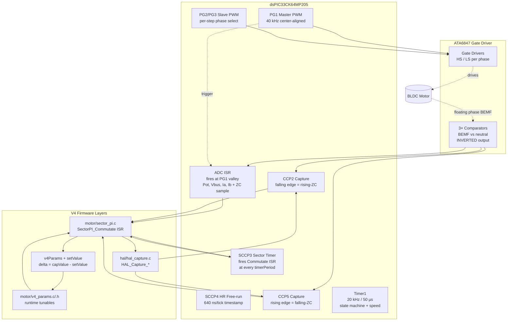
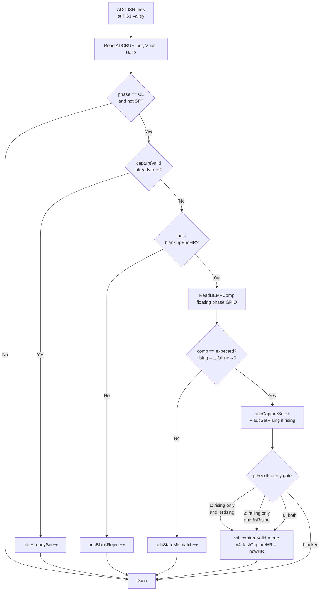
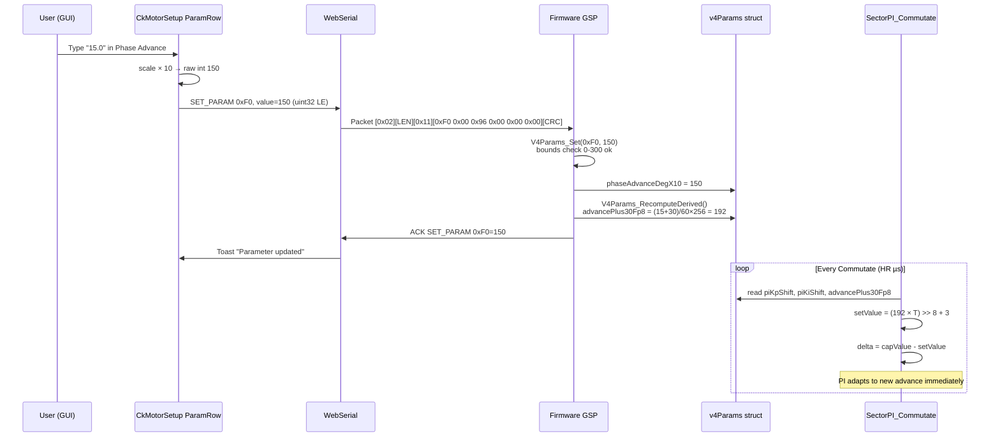

# V4 Sector PI — Architecture & Implementation Journey

> **Hardware:** dsPIC33CK64MP205 + ATA6847 (EV43F54A board)
> **Status:** Production baseline, runtime-tunable from GUI
> **Peak measured:** 196k eRPM (no prop, 12% duty), 14k eRPM sustained (with prop, 12% duty)

---

## Table of Contents

1. [Why V4 Exists](#why-v4-exists)
2. [Architecture Overview](#architecture-overview)
3. [Hot Path — Capture → PI → Commutate](#hot-path--capture--pi--commutate)
4. [Runtime Parameter System (Phase A)](#runtime-parameter-system-phase-a)
5. [Telemetry & GUI Visibility (Phase C)](#telemetry--gui-visibility-phase-c)
6. [Bench Investigation Journey](#bench-investigation-journey)
7. [Performance Baselines](#performance-baselines)
8. [Known Issues & Future Work](#known-issues--future-work)
9. [File Reference](#file-reference)

---

## Why V4 Exists

V3 reached 100k eRPM but couldn't keep going. The architecture had grown to include:

- 100 kHz software poll
- DMA ring buffers
- Cluster detection
- Corridor gating
- Plausibility windows
- Reactive/shadow/ownership mode switching
- TAL mixing torque advance with poll latency compensation

Every fix in one layer exposed a new bug in another. The Microchip AVR high-speed reference (`avr-motor-control-high-speed/fw/common_files/motor/motor.c`) achieves 250k+ eRPM with **~200 lines** — two timers, one PI, one ISR.

**V4 is a ground-up rewrite** that copies this minimal architecture onto our dsPIC33CK + ATA6847 hardware. Everything that's not absolutely required is gone.

---

## Architecture Overview

### Component Diagram



### Timer Mapping

| Role | AVR (reference) | dsPIC33CK V4 | Notes |
|------|-----------------|--------------|-------|
| Sector timer | TCB0 (periodic) | **SCCP3** auto-reload | PI writes new period each sector |
| Capture timer | TCB1 (CAPT mode) | **CCP2 + CCP5** IC | Both ISRs drain FIFO; last-edge-wins |
| HR timestamp | N/A | **SCCP4** free-running | 640 ns/tick |
| System tick | RTC PIT (1 ms) | **Timer1** 20 kHz | State machine, speed measurement |

### Capture Modes (`FEATURE_V4_MIDPOINT_ZC`)

| Mode | Method | Status |
|------|--------|--------|
| 0 | CCP edge capture + 3-read deglitch | **Buggy** — deglitch state-checks inverted; needs fix before use |
| **1** | **ADC ISR samples comp at PG1 valley** | **Active baseline** — proven 196k eRPM |
| 2 | Hybrid: ADC confirms state, CCP timestamps | Untested in V4 |

Mode 1 is what's running. The ADC ISR fires at the PWM valley (PG1TRIGA = 0), reads the floating phase comparator GPIO, and votes "valid capture" if past blanking and matching expected polarity state.

---

## Hot Path — Capture → PI → Commutate

### SectorPI_Commutate ISR Flow

```mermaid
sequenceDiagram
  autonumber
  participant SCCP3 as SCCP3 Period Match
  participant ISR as SectorPI_Commutate
  participant PI as Set-point PI
  participant HAL as HAL_Capture / HAL_PWM
  participant SCCP3b as SCCP3 next match

  SCCP3->>ISR: Fire (timerPeriod elapsed)
  ISR->>ISR: Disable CCP2/5 ISR (critical section)
  ISR->>ISR: Read v4_lastCaptureHR<br/>capValue = elapsed - prevCommHR
  alt v4Params.piFeedPolarity matches sector
    ISR->>PI: setValue = (advance+30)/60 × T<br/>delta = capValue - setValue
    PI->>PI: integrator += delta>>4 (Ki=1/16)
    PI->>PI: timerPeriod = integrator + delta>>2 (Kp=1/4)
    PI->>ISR: New timerPeriod
  else gate skips
    ISR->>ISR: Skip PI math (capture counted only)
  end
  ISR->>HAL: position++; HAL_PWM_SetCommutationStep
  ISR->>HAL: HAL_Capture_Configure(new floating phase + polarity)
  ISR->>HAL: HAL_Capture_SetBlanking(timerPeriod × blankingPct/100)
  ISR->>SCCP3b: Schedule next sector via reactive target<br/>targetHR = lastCaptureHR + delayHR
  ISR->>HAL: HAL_PWM_SetDutyCycle(amplitude scaled)
  ISR->>ISR: Stall check / re-enable CCP2/5
  Note over SCCP3b: Cycle repeats
```

### ADC ISR ZC Detection (Mode 1)



### Set-point PI Math

```c
setValue = (advance° + 30°) / 60° × timerPeriod + RC_DELAY_HR
delta    = capValue - setValue                        // signed, int32
integrator += delta >> Ki_SHIFT                       // Ki = 1/16 → KI_SHIFT = 4
timerPeriod = integrator + (delta >> Kp_SHIFT)        // Kp = 1/4  → KP_SHIFT = 2
// Clamp: minPeriodHr ≤ timerPeriod ≤ 0xFFFF
```

The setValue formula is from Microchip AVR motor.c. It assumes `capValue` arrives at `(advance+30)/60 × T`, which is correct for AVR-style real-ZC edge captures. Mode 1 captures at pre-ZC midpoint (different fraction of T), so the **single value of `advance = 10°` empirically balances the mismatch** across the speed range. See [Bench Investigation Journey](#bench-investigation-journey).

---

## Runtime Parameter System (Phase A)

### Architecture

V3 had 38 runtime params via GSP `GET_PARAM` / `SET_PARAM`. V4 was originally compile-time constants only. Phase A re-plumbed the param system for V4:

- `motor/v4_params.h/c` — `V4_PARAMS_T` struct, defaults loader, descriptor table
- `gsp/gsp_commands.c` — V4-specific GET_PARAM/SET_PARAM/GET_PARAM_LIST handlers (replaces stub)
- `gui/src/protocol/types.ts` — descriptor table extended with V4 IDs (`0xF0–0xFF`)
- `gui/src/components/CkMotorSetup.tsx` — auto-renders V4 params in 3 group cards

### Tunable Parameters (current set)

| ID | Name | Group | Range | Default | Notes |
|----|------|-------|-------|---------|-------|
| `0xF0` | Phase Advance | V4 PI Loop | 0–30° (×0.1°) | 10.0° | Empirically optimal across speed range |
| `0xF1` | PI Kp Shift | V4 PI Loop | 0–8 | 2 (Kp=1/4) | Higher shift = smaller Kp = slower response |
| `0xF2` | PI Ki Shift | V4 PI Loop | 0–8 | 4 (Ki=1/16) | Smaller Ki = less drift |
| `0xF3` | Blanking % | V4 Capture | 10–60 | 40 | % of sector period blanked after commutation |
| `0xF5` | PI Feed Polarity | V4 Capture | 0–2 | 1 (rising) | 0=both / 1=rising / 2=falling |
| `0xF4` | Min Period | V4 Limits | 5–500 HR | 10 | Speed ceiling guard |

All are **HOT** — change while motor running, takes effect on next Commutate ISR.

### How a SET_PARAM Flows



---

## Telemetry & GUI Visibility (Phase C)

### Diagnostic Counters in Snapshot

The 66-byte snapshot carries (slots are byte offsets, after 2-byte sequence header):

| Slot | Field | Type | What it means |
|------|-------|------|---------------|
| 18-19 | `timerPeriod` | u16 | PI commanded sector period (HR ticks) |
| 22-25 | `eRPM` | u32 | Derived from timerPeriod |
| 26-27 | `sectorCount` low | u16 | Total Commutate cycles (wraps) |
| 28-29 | `diagLastCapValue` | u16 | Most recent capValue |
| **30-31** | **`diagDelta`** | **i16** | **PI loop error (capValue − setValue)** |
| 32-33 | `diagCaptures` | u16 | Sectors with valid capture |
| 34-35 | `diagPiRuns` | u16 | Sectors that ran PI math (= diagCaptures in current code) |
| 36 | `stallCounter` | u8 | Consecutive no-capture sectors |
| 37 | `spBits` | u8 | bit0=spActive, bit1=spRequest |
| 38-39 | `erpmTP` | u16 | Actual measured eRPM (from actualStepPeriodHR) |
| 48-51 | `adcBlankReject` | **u32** | ADC fires during blanking |
| 52-55 | `adcStateMismatch` | **u32** | ADC fires past blanking, GPIO ≠ expected |
| 56-59 | `adcCaptureSet` | **u32** | ADC fires that set captureValid (both polarities) |
| 60-63 | `adcSetRising` | **u32** | Subset on rising sectors; falling = total - rising |

The four `u32` ADC counters were upgraded from `u16` after discovering wrap-around at 40 kHz ADC rate (~1.6 s wrap).

### Dashboard Tab — V4 Diagnostics Card

`gui/src/components/CkDashboard.tsx` renders this when `info.featureFlags & 0x80000000` is set:

- **PI Delta** (color-coded: green ≤30, yellow ≤100, red >100)
- **Last CapValue / timerPeriod / actual eRPM** — three numbers that should track each other
- **Cap%** progress bar (`diagCaptures / sectorCount`)
- **R/F% split** (rising vs falling, computed live)
- **Bnk/Mis/Set distribution** stacked bar
- **SP ACTIVE / SP REQ** badges

### Scope Tab — V4 Sector PI Panel

New 4th panel (alongside Speed/Current/ZC) with channels:

- `PI Delta` (line trace, zero-line reference) — primary tuning instrument
- `Last CapValue`, `timerPeriod`, `eRPM (actual)`
- `Cap%`, `Set%`, `Mis%`, `Bnk%`, `Rising %` — running percentages

Two new presets:
- **V4 PI Loop** — delta + last cap + timerPeriod + actual eRPM
- **V4 Capture Mix** — Cap% + Set% + Mis% + Bnk% + Rising%

---

## Bench Investigation Journey

This section documents the surprising things we found while tuning V4. Each finding is a real bench observation — not theoretical.

### Finding 1: Cap% sits at 49% — and it's a polarity asymmetry

**Symptom:** Mode 1 baseline reaches 196k eRPM but `Cap% = 49%` consistently. Half the sectors have no capture.

**Investigation:** Added `adcSetRising` counter. Discovered **R/F = 100/0** — every successful capture was on a rising-ZC sector. Falling sectors (1, 3, 5 — float-after-PWM-HIGH) produced zero captures with no prop.

**Root cause hypothesis:** The ATA6847 comparator has no hysteresis. On falling sectors, HIGH-side body-diode demag dynamics make the BEMF linger near neutral for the entire post-blanking window. The comparator output is noise, not a stable state — Mode 1's GPIO sample-and-compare can't catch a consistent value.

**Confirming evidence:**
- Run 1 (`expected = IsRising ? 1 : 0`): R/F = 100/0 (rising-only Sets)
- Run 2 (`expected = 1` for both polarities): still R/F = 100/0 — falling sees neither stable 0 nor stable 1
- Both findings consistent with "comparator output is noise on falling sectors"

**Resolution:** Mode 1 with rising-only feedback is the stable baseline. PI absorbs the half-rate update via integrator dynamics. Motor reaches 196k eRPM despite missing 50% of feedback.

### Finding 2: Mode 0 deglitch state-checks are inverted (real bug)

**Test:** Switched to `FEATURE_V4_MIDPOINT_ZC = 0` (CCP edge capture + 3-read deglitch). Expected R/F ~50/50. Got **R/F = 0/100** — every capture was falling, opposite of Mode 1.

**Trace:** Reading the deglitch code in `garuda_service.c`:
- CCP2 catches falling comp edges (= real rising-ZC). Code checks `comp == 1` post-edge.
- CCP5 catches rising comp edges (= real falling-ZC). Code checks `comp == 0` post-edge.

But on inverted ATA6847: post-rising-ZC, comp settles at **0** (not 1). And post-falling-ZC, comp settles at **1** (not 0). The deglitch was rejecting every real ZC and only accepting comparator noise bounces — which apparently happen more often on falling sectors.

**Status:** Bug documented in code comments. Mode 0 is currently NOT used. To enable: flip both deglitch checks (`==1` ↔ `==0`).

### Finding 3: Mode 0 with corrected deglitch hits 200k eRPM but desyncs

**Test:** Flipped both Mode 0 deglitch checks. Result: motor briefly reached 200-240k eRPM, then desynced within 200 ms.

**Cause:** Rising and falling sectors now both produced captures, but with **different relative timestamp offsets** (because rising sector "real ZC" arrives at a slightly different fraction of T than falling sector "real ZC" — demag dynamics differ). Feeding both into a PI tuned for one polarity caused immediate desync at CL engagement.

**Status:** Mode 1 is the production baseline. Mode 0 needs per-polarity offset compensation before it's usable.

### Finding 4: With prop, both polarities can capture — but loop still desyncs without polarity gate

**Bench observation:** With prop attached, R/F shifted to mixed values (run 1: 0/100 falling-dominant, run 2: 67/33 rising-dominant). Why? Prop inertia damps comp chatter on falling sectors — they can now capture. But the timing offset between polarities still causes PI desync.

**Resolution:** Added `piFeedPolarity` runtime param (`0xF5`). Default = 1 (rising-only). User can switch to 2 (falling-only) if the load + comparator combo favors falling. Diagnostic counters still see the non-fed polarity for visibility.

**Bench validation:** With `piFeedPolarity = 1`, the prop runs that previously desynced now sustain 14k eRPM at 12% duty stably for 15+ seconds.

### Finding 5: Phase Advance optimum is empirical, not physical

**Bench test (no prop, full pot):**

| Advance | Result |
|---------|--------|
| 5° | Motor stalls beyond ~50% duty |
| 9° | Reaches full speed |
| **10°** | **Reaches 196k eRPM (proven baseline)** |
| 11° | Reaches full speed |
| 15° | Stalls beyond ~50% duty |

**Why 10° is special:** It's the value where `capValue ≈ setValue` for Mode 1's pre-ZC capture timing. The setValue formula `(advance+30)/60 × T = 0.667T` was designed for AVR-style real-ZC captures landing at `2T/3`. Mode 1 captures at pre-ZC midpoint (~`T/2` empirically). 10° is the value that empirically balances the formula bias against the actual capture position across the operating speed range.

**Implication:** Speed-adaptive advance with the current setValue formula won't unlock more RPM — it's tuning a fudge factor. Real improvement needs either:
- Recalibrated setValue formula (per-speed lookup based on measured capValue/T ratios)
- Per-polarity offset compensation if Mode 0 is revived

### Finding 6: 2× discrepancy between PI commanded and measured period

**Observation:** During steady CL operation, `eRPM` (= `15625000 / timerPeriod`) shows ~14000 while `eTP` (= `15625000 / actualStepPeriodHR`) shows ~6800. Ratio is ~2×.

**Likely cause:** The reactive scheduler in `sector_pi.c:557-565` schedules next commutation at `lastCaptureHR + delayHR`, where `delayHR ≈ T/2 - advance`. This produces an actualStepPeriodHR ≈ 0.875T, but with rising-only updates (every other sector firing reactively), the average pattern becomes ~2T per measured period.

**Status:** Not currently a problem — motor is stable, telemetry shows both numbers. Investigate when it starts mattering (e.g., for speed-control PID).

---

## Performance Baselines

### No Prop (Bench)

| Configuration | Peak eRPM | Cap% | Notes |
|---------------|-----------|------|-------|
| Mode 1, advance=10°, KP/KI=2/4, polarity=rising-only | **196k** | 49% | Production baseline (commit `66c4dd0`) |
| Mode 0 corrected deglitch (both polarities) | 200-240k brief | 49% | Desyncs within 200 ms — not stable |
| Mode 1, advance=15° | < 50% duty before stall | n/a | Over-advance for our setValue formula |
| Mode 1, advance=5° | < 50% duty before stall | n/a | Under-advance for our setValue formula |

### With Prop (8x4.5 on A2212, 24V)

| Configuration | Sustained eRPM | Cap% | Notes |
|---------------|----------------|------|-------|
| Mode 1, polarity=rising-only, advance=10° | 14000 @ 12% duty | 49% | Stable for 15+ seconds across multiple CL entries |
| Mode 1, polarity=both | desyncs at CL engagement | n/a | Mixed polarity feed unstable |

### Comparison vs V3

| Metric | V3 best | V4 baseline | Improvement |
|--------|---------|-------------|-------------|
| Peak eRPM | 100k (reactive scheduler ownership unstable) | 196k | +96% |
| Code complexity | ~3000 lines (sectorPI subsystem) | ~600 lines | -80% |
| Architectural clarity | High (multiple modes, fallbacks) | Low (one path, one PI) | qualitative |

---

## Known Issues & Future Work

### Open

| Item | Severity | Notes |
|------|----------|-------|
| **EEPROM persistence** | High | `SAVE_CONFIG` is a stub. Tuned settings revert to defaults on every reboot. Phase B planned. |
| **Falling sector capture bias** | Medium | Mode 1 ignores falling sectors entirely; uses 50% of available feedback rate. Not a problem at current 196k peak but caps further improvement. |
| **setValue formula mismatch** | Medium | Formula assumes AVR-style real-ZC captures; Mode 1 captures pre-ZC midpoint. Single magic value (10°) hides the issue. Real fix: per-speed `capValue/T` calibration table. |
| **Mode 0 deglitch convention** | Low | Documented bug, fix is one line. Currently unused. |
| **2× eTP/eRPM discrepancy** | Low | Reactive scheduler produces actualStepPeriodHR different from PI commanded. Affects display interpretation, not stability. |
| **Ibus calibration** | Low | Ibus reconstructed per-step but uses V3 `CK_CURRENT_SCALE = 1.049` constant. May need V4-specific scaling. |

### Roadmap

| Phase | Status | Description |
|-------|--------|-------------|
| **A** | ✅ Done | Runtime params (6 hot tunables), GSP wiring, GUI display |
| **B** | Planned | EEPROM persistence (Data Flash R/W, magic+CRC, 2-3 profile slots) |
| **C.1+2** | ✅ Done | V4 dashboard panel + scope V4 PI panel |
| **C.3** | Planned | capValue ring buffer (32-entry) + GSP `GET_CAPTURE_HISTORY` cmd + GUI histogram |
| **D** | Future | Auto-tune wizards (advance sweep, gain optimization) |
| **E** | Future | Speed-adaptive advance + recalibrated setValue formula |
| **F** | Future | Per-step blanking, current limit PID, DShot input, brake on stop |

---

## File Reference

### Firmware (V4-specific)

| Path | Role |
|------|------|
| `garuda_6step_ck.X/garuda_config.h` | All V4 #defines (FEATURE_V4_SECTOR_PI, advance default, KP/KI, etc.) |
| `garuda_6step_ck.X/motor/sector_pi.c/.h` | Set-point PI loop, EnterCL, Commutate ISR caller, settle timer |
| `garuda_6step_ck.X/motor/v4_params.c/.h` | Runtime tunable struct + GSP-facing API (Phase A) |
| `garuda_6step_ck.X/motor/commutation.c` | 6-step table (zcPolarity, floatingPhase per step) |
| `garuda_6step_ck.X/hal/hal_capture.c/.h` | CCP2/CCP5 init, PPS remap, blanking computation |
| `garuda_6step_ck.X/hal/hal_sector_timer.c/.h` | SCCP3 sector timer + SCCP4 HR timer |
| `garuda_6step_ck.X/hal/hal_pwm.c` | PWM HAL, per-step commutation |
| `garuda_6step_ck.X/garuda_service.c` | All ISRs (ADC, CCP2, CCP5, CCT3 wrapper, Timer1) |
| `garuda_6step_ck.X/gsp/gsp_commands.c` | V4 GSP dispatcher + telemetry packing |

### GUI (V4-aware)

| Path | Role |
|------|------|
| `gui/src/protocol/types.ts` | `CkSnapshot` V4 fields; `CK_PARAM_*` extended for V4 IDs; `isV4Firmware()` helper |
| `gui/src/protocol/decode.ts` | `decodeCkSnapshot` decodes V4 fields (signed delta, uint32 counters) |
| `gui/src/components/CkDashboard.tsx` | Dashboard panel — auto-renders V4 diagnostics card on V4 firmware |
| `gui/src/components/CkMotorSetup.tsx` | Param editor — V4 params appear in 3 group cards with format support |
| `gui/src/components/CkScopePanel.tsx` | Scope — V4 PI panel with delta/cap/timerPeriod/eRPM traces + 2 V4 presets |

### Tools

| Path | Role |
|------|------|
| `tools/pot_capture.py` | Bench telemetry capture; V4 diagnostic columns (Bnk%/Mis%/Set%/R/F%/Fires) |

---

## Build Instructions

### Prerequisites

- MPLAB X v6.00+
- XC16 v2.10+
- Node.js 18+ (for GUI)

### Firmware (CLI)

```bash
cd PATA6847/garuda_6step_ck.X
make -f Makefile-cli.mk MOTOR_PROFILE=2     # 0=Hurst, 1=A2212, 2=2810
```

### Firmware (MPLAB X IDE)

Open `PATA6847/garuda_6step_ck.X` as a project. Set MOTOR_PROFILE in `garuda_config.h:17` if needed. Build & Program.

The MPLAB project tracks `motor/v4_params.c` in `nbproject/configurations.xml`. If your IDE regenerates `Makefile-default.mk`, verify it includes `v4_params.o` in `OBJECTFILES` and `OBJECTFILES_QUOTED_IF_SPACED`.

### GUI

```bash
cd gui
npm install
npm run dev    # Vite dev server
# OR
npm run build  # Production bundle in dist/
```

Open `http://localhost:5173/` in Chrome/Edge (WebSerial requires Chromium-family browser).

---

*Last updated: 2026-04-16. Maintained alongside firmware in `PATA6847/docs/v4_architecture.md`.*
